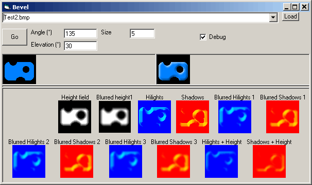



## A photoshop\-like BEVEL EFFECT in VB

### Description

This program takes a bitmap image and applies a bevel effect to it, adding hilights and shadows to make it appear 3-D.

The direction and elevation of the light can be changed, as can the size of the bevel.

Includes a "debug" mode which shows the process step-by-step (see screenshot)

Some of the calculations have been converted to integer calculations for speed. Others still use floating-point, this is one future optimization that I might do.
 
### More Info
 
The code uses the cDibBitmap class for www.vbaccelerator.com

Error checking is minimal.

             |
---                |---
**Submitted On**   |2004-02-10 11:17:02
**By**             |[grigri](https://github.com/Planet-Source-Code/PSCIndex/blob/master/ByAuthor/grigri.md)
**Level**          |Intermediate
**User Rating**    |4.9 (59 globes from 12 users)
**Compatibility**  |VB 6\.0
**Category**       |[Graphics](https://github.com/Planet-Source-Code/PSCIndex/blob/master/ByCategory/graphics__1-46.md)
**World**          |[Visual Basic](https://github.com/Planet-Source-Code/PSCIndex/blob/master/ByWorld/visual-basic.md)
**Archive File**   |[A\_photosho1706652102004\.zip](https://github.com/Planet-Source-Code/grigri-a-photoshop-like-bevel-effect-in-vb__1-51640/archive/master.zip)

